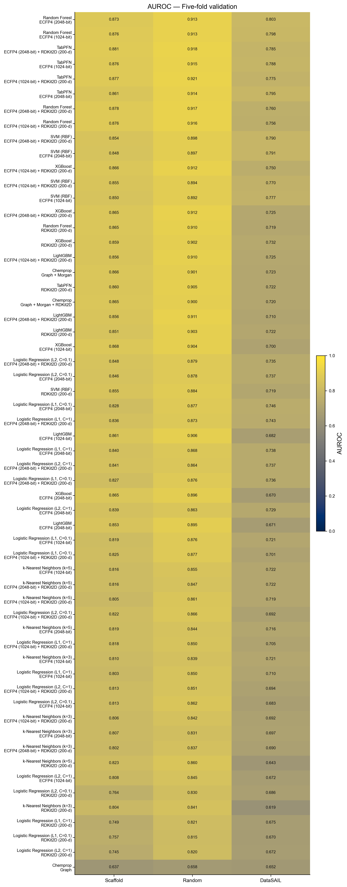
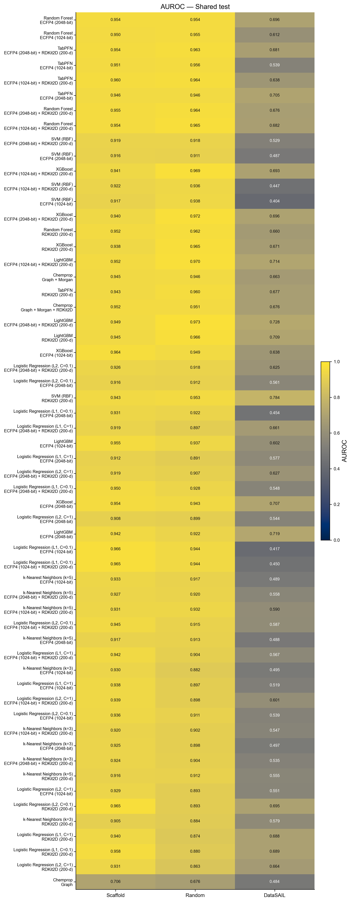

# μORScreen model comparison

Generated at 2026-07-25T04:26:34.159303+00:00.

## Evaluation contract

All 58 frozen candidates are shown with the same naming, ordering, and visual treatment. Metrics are mean ± sample SD over five fold models; 95% Student-t intervals are retained in `all_candidates.csv`. Test results are descriptive and must not drive tuning, threshold changes, ranking, or deployment decisions.

## AUROC overview

| Protocol | Stage | N | Median | Q1 | Q3 | Min | Max |
| --- | --- | --- | --- | --- | --- | --- | --- |
| DataSAIL | Shared test | 58 | 0.602 | 0.539 | 0.68 | 0.404 | 0.784 |
| DataSAIL | Five-fold validation | 58 | 0.721 | 0.693 | 0.742 | 0.619 | 0.803 |
| Random | Shared test | 58 | 0.922 | 0.902 | 0.954 | 0.676 | 0.973 |
| Random | Five-fold validation | 58 | 0.878 | 0.851 | 0.905 | 0.658 | 0.921 |
| Scaffold | Shared test | 58 | 0.94 | 0.924 | 0.952 | 0.706 | 0.966 |
| Scaffold | Five-fold validation | 58 | 0.843 | 0.814 | 0.861 | 0.637 | 0.881 |

## Files

- `figures/`: AUROC main figures and metric-level supporting figures.
- `all_candidates.csv`: complete wide-format metrics and provenance fields.
- `metrics_long.csv`: tidy candidate × protocol × stage × metric table.
- `validation_test_gap.csv`: descriptive test-minus-validation differences.
- `manifest.json`: input provenance and output SHA256 checksums.

No Top-1 model is selected.
