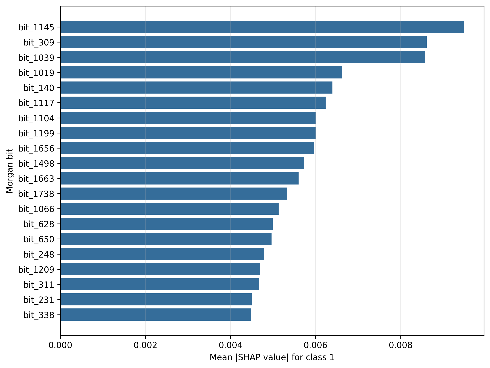
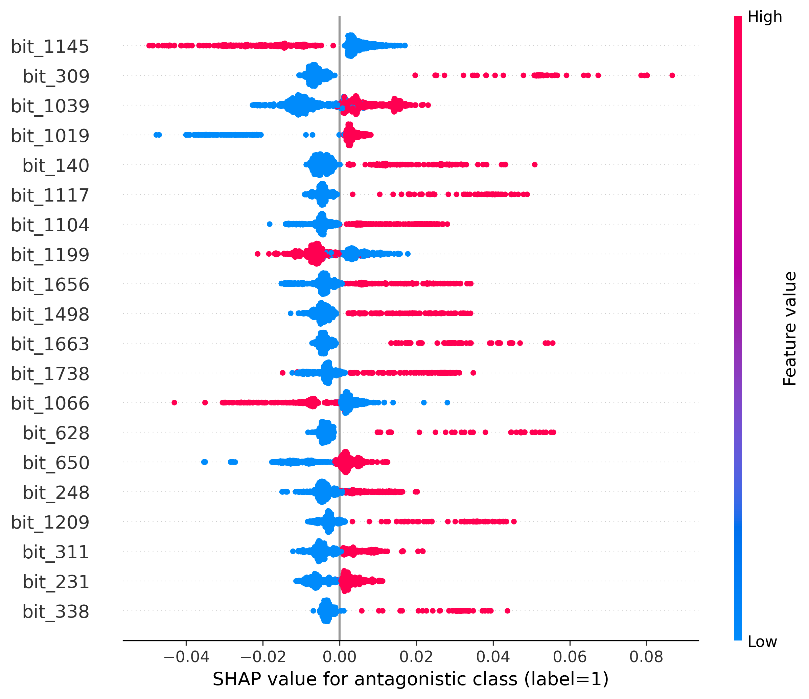
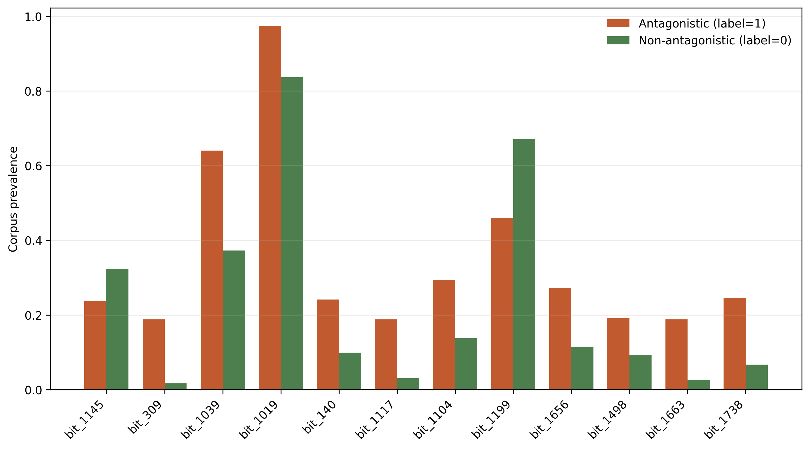

# RF/ECFP4-2048 full-corpus explanation

## Contract

The model was fixed from validation evidence only: highest mean validation AUROC across scaffold, random, and DataSAIL (0.8630). It was then refit on all 982 deduplicated labeled molecules. This refit has no independent holdout metric; Workflow 30 remains the performance evidence.

`label=1` means antagonistic. Scores are uncalibrated class-1 RF scores and are suitable for relative screening priority, not calibrated probability claims.

## Global class-1 TreeSHAP

| Rank | Bit | Mean \|SHAP\| | Mean SHAP | Label-1 prevalence | Label-0 prevalence |
| ---: | ---: | ---: | ---: | ---: | ---: |
| 1 | bit_1145 | 0.0095 | -0.0026 | 0.237 | 0.324 |
| 2 | bit_309 | 0.0086 | -0.0028 | 0.189 | 0.017 |
| 3 | bit_1039 | 0.0086 | -0.0018 | 0.640 | 0.373 |
| 4 | bit_1019 | 0.0066 | -0.0009 | 0.974 | 0.837 |
| 5 | bit_140 | 0.0064 | -0.0015 | 0.241 | 0.099 |
| 6 | bit_1117 | 0.0062 | -0.0021 | 0.189 | 0.031 |
| 7 | bit_1104 | 0.0060 | -0.0022 | 0.294 | 0.138 |
| 8 | bit_1199 | 0.0060 | -0.0025 | 0.461 | 0.671 |
| 9 | bit_1656 | 0.0060 | -0.0017 | 0.272 | 0.115 |
| 10 | bit_1498 | 0.0057 | -0.0022 | 0.193 | 0.093 |
| 11 | bit_1663 | 0.0056 | -0.0018 | 0.189 | 0.027 |
| 12 | bit_1738 | 0.0053 | -0.0016 | 0.246 | 0.068 |

## Morgan environments

Among the top 20 hashed bits, 19 map to more than one observed atom environment. `bit_environments.csv` retains every observed mapping instead of assigning a single pharmacophore name to a collided bit.

## Training-corpus behavior cases

These examples are selected from molecules used for the full-data refit. They show model behavior and are not TP/FP or generalization-error evidence. Green environments increase the class-1 score; red environments decrease it.

- `high_antagonistic` #1: label=1, score=1.000, [0](figures/local_cases/high_antagonistic_01.png)
- `high_antagonistic` #2: label=1, score=0.993, [58](figures/local_cases/high_antagonistic_02.png)
- `high_antagonistic` #3: label=1, score=1.000, [146](figures/local_cases/high_antagonistic_03.png)
- `high_antagonistic` #4: label=1, score=0.998, [145](figures/local_cases/high_antagonistic_04.png)
- `high_non_antagonistic` #1: label=0, score=0.000, [228](figures/local_cases/high_non_antagonistic_01.png)
- `high_non_antagonistic` #2: label=0, score=0.000, [256](figures/local_cases/high_non_antagonistic_02.png)
- `high_non_antagonistic` #3: label=0, score=0.000, [266](figures/local_cases/high_non_antagonistic_03.png)
- `high_non_antagonistic` #4: label=0, score=0.000, [254](figures/local_cases/high_non_antagonistic_04.png)
- `boundary` #1: label=0, score=0.501, [241](figures/local_cases/boundary_01.png)
- `boundary` #2: label=1, score=0.638, [123](figures/local_cases/boundary_02.png)
- `boundary` #3: label=1, score=0.625, [217](figures/local_cases/boundary_03.png)
- `boundary` #4: label=1, score=0.559, [188](figures/local_cases/boundary_04.png)
